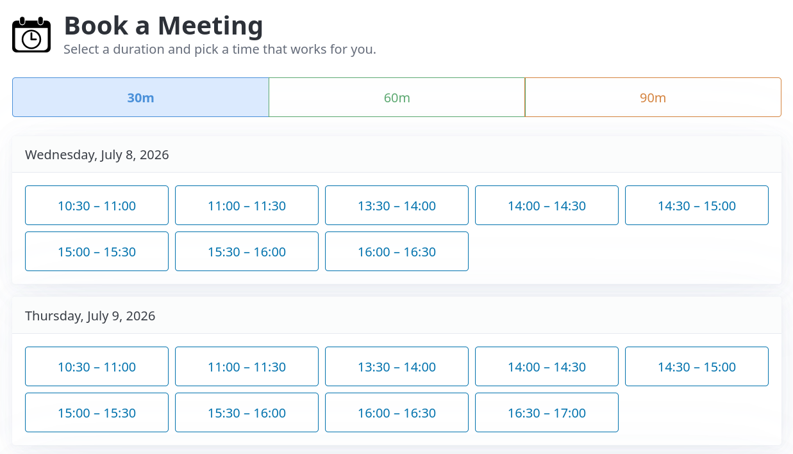

<div align="center">


# Zeitfenster

*Minimal, self-hosted appointment request service.*

[](LICENSE)
[](pyproject.toml)
[](https://fastapi.tiangolo.com/)
[](https://www.docker.com/)
[](https://docs.astral.sh/uv/)
[](https://github.com/Embedded-Focus/zeitfenster/commits/main)

**[How It Works](#how-it-works)** ·
**[Security](#security)** ·
**[Quick Start](#quick-start-demo)** ·
**[Federation](#federation)** ·
**[Configuration](#configuration)**

</div>

Minimal, self-hosted appointment request service. Reads existing calendars (CalDAV, ICS feeds) to compute availability and presents free slots on a web page. Customers pick a slot and submit their contact details — you receive an email with an `.ics` draft event to import, edit, and use for the calendar invitation.

The application never writes to any calendar. You stay in control of every meeting request.



## How It Works

1. A background task periodically reads CalDAV calendars, ICS feeds, and free slots from other Zeitfenster instances (see [Federation](#federation)).
2. Free slots are computed based on your working hours, buffer, federation members, and other rules.
3. A static HTML page is generated and served by Caddy.
4. When a customer requests a slot, a small FastAPI endpoint sends you an email with an `.ics` attachment.
5. You import the `.ics` draft, add final meeting details or meeting links, and send the actual invitation from your calendar client.

The attached `.ics` files are drafts for the owner. Importing them into the owner's calendar does not send invitations by itself; customer invitations are sent separately from your calendar client after you have reviewed and edited the event.

All-day calendar events are treated as busy for the full local day. Multi-day all-day events, such as vacations, block every working-hour slot they cover.

## Architecture

```
Internet → [Traefik] → Caddy (static files + reverse proxy)
                            ↓ POST /book, GET /api/free-slots
                        Python App (FastAPI)
                            ↓ read-only
                        CalDAV / ICS Calendars
```

Two containers in production:
- **Caddy** — serves static files, proxies `/book` and `/api/*` to the app. No credentials, no Python.
- **Python App** — reads calendars, computes slots, generates HTML, sends booking emails. Internal-only, not exposed to the internet.

## Security

Zeitfenster is designed around a small public surface and a secret-free frontend container.

- **Read-only calendars:** the app reads CalDAV and ICS sources, but never writes to calendars. Meeting requests are sent as draft `.ics` email attachments for manual import.
- **ICS feed hardening:** `availability.ics_urls` entries must use `https://`; plain `http://` feeds are rejected at config load. Fetches never auto-follow redirects — each hop is resolved and checked manually, and the fetch is rejected if a redirect leaves `https` or points at a different host than the originally configured URL. This guards against a compromised or leaked feed URL being used to redirect the backend at internal/private addresses (SSRF). A rejected feed fails that regeneration cycle only; the previously generated site keeps serving its last known-good state instead of exposing a broken or manipulated result.
- **Secret isolation:** Caddy serves static files and proxies selected requests, but does not receive CalDAV or SMTP credentials. Those stay in the internal Python app container.
- **SMTP auth is independent of STARTTLS, and never sent unencrypted:** `email.smtp_use_auth` (default `true`) controls whether SMTP credentials are sent, separately from `email.smtp_start_tls`. Previously, disabling STARTTLS silently disabled auth too; now the two are decoupled, so turning off STARTTLS no longer has the side effect of also sending unauthenticated mail. A startup warning is logged whenever STARTTLS is disabled, since booking emails (customer name, email, slot time) then go out in plaintext. That decoupling also opened a gap — auth with no encryption at all — so `smtp_use_auth` now requires `smtp_start_tls` or `smtp_use_tls` to be enabled; this is enforced at config load (the invalid combination can't even be constructed) and defensively re-checked immediately before the SMTP call itself.
- **Implicit TLS (SMTPS) supported:** `email.smtp_use_tls` (default `false`, typically port `465`) is available as an alternative to STARTTLS. The two are mutually exclusive connection-security modes; enabling both is rejected at config load.
- **Unprivileged runtime:** the Python app container runs as a dedicated non-root user (fixed uid/gid `10001`), not root. `/site` is owned by that user so the shared `site-data` volume works without privilege escalation; bind-mounted config files must stay world-readable or be chowned to uid `10001` accordingly.
- **No database or sessions:** state is derived from configuration, calendar reads, generated static files, and in-memory availability.
- **Bounded booking input:** booking form fields are normalized and size-limited before use. Names reject control characters, and customer email addresses are checked for a valid basic shape with a dotted domain. The generated form mirrors key limits with native browser validation.
- **Booking slot validation:** `POST /book` does not trust submitted hidden form fields by themselves. The backend parses timezone-aware datetimes, requires `slot_end > slot_start`, checks that the posted duration is configured and matches the submitted range, and requires `(duration, slot_start, slot_end)` to exactly match a currently advertised slot in memory.
- **Request abuse controls:** accepted meeting requests pass through an in-memory global rate limit before email delivery. Request-triggered availability regeneration is coalesced so repeated posts cannot create unlimited concurrent calendar refresh tasks. Caddy also caps `/book` request bodies.
- **Optional Cap CAPTCHA:** `POST /book` can require a token from a self-hosted Cap instance. The browser loads Cap's widget from the Cap server and solves the challenge before submitting the form; the internal Python app verifies the token with Cap's `/siteverify` endpoint before slot validation, rate limiting, `.ics` generation, SMTP, or regeneration. Cap reduces automated abuse, but the current-slot validation remains the booking authority.
- **Browser hardening:** booking-page JavaScript is served as a static asset, with no inline event handlers. Caddy sends a Content Security Policy, `X-Content-Type-Options: nosniff`, and `Referrer-Policy`.
- **User-facing validation errors:** booking form submissions are intercepted by the static JavaScript. Backend validation failures are mapped back to native browser validation messages instead of exposing raw JSON error responses to normal users.
- **Fail-before-side-effects:** invalid, forged, stale, malformed, or timezone-naive meeting requests are rejected before `.ics` generation, SMTP delivery, or availability regeneration.
- **Federation privacy boundary:** `/api/free-slots` exposes computed free slots only. Federation members do not receive raw busy intervals or calendar event details.
- **Embedding is opt-in:** `frame-ancestors 'none'` blocks framing by default. Operators explicitly allowlist embedding origins via `ZEITFENSTER_ALLOWED_EMBED_ORIGINS`. Allowing an origin to frame the page only lets that origin control the iframe's container — it does not expose booking data beyond what the public page already shows, and `/book`'s slot revalidation is unchanged.

## Quick Start (Demo)

```sh
make up
```

This starts a full demo environment with:
- Booking page at `http://localhost:8080`
- Mailpit (email viewer) at `http://localhost:8025`
- Radicale (CalDAV server) with sample recurring events

## Project Layout

```
src/zeitfenster/
├── app.py                  FastAPI app (POST /book, GET /api/free-slots, scheduler)
├── availability.py         Free slot computation, intersection, orchestrator
├── caldav_client.py        CalDAV read wrapper
├── ics_client.py           ICS URL feed reader
├── zeitfenster_client.py   Federation client (fetches remote free slots)
├── config.py               Pydantic config (YAML + env vars)
├── email.py                SMTP email with .ics attachment (multi-recipient)
├── generator.py            Static site generator (Jinja2 → HTML)
├── ics.py                  .ics file builder (owner-side draft VEVENT)
├── parsing.py              Duration and time range parsing
├── templates/              Jinja2 templates (base, index, thankyou, placeholder)
└── static/                 Pico CSS + custom styles

tests/                  Unit and integration tests
demo/                   Demo environment (Radicale config, sample calendars, .env)
Dockerfile              Multi-stage build
Caddyfile               Caddy reverse proxy config
compose.yaml            Demo environment (Caddy + app + Radicale + Mailpit)
compose.prod.yaml       Production override (Traefik labels, no demo services)
pod.yaml                Podman kube reference (production)
config.example.yaml     Example configuration
```

## Federation

Multiple zeitfenster instances can be federated so customers only see slots when **all** team members are free. Each instance exposes its computed free slots via `GET /api/free-slots`. A federation instance fetches those and intersects them — it never learns individual busy times.

```yaml
availability:
  zeitfenster_urls:
    - url: https://alice.example.com
    - url: https://bob.example.com
      token_env: BOB_ZEITFENSTER_TOKEN

federation:
  free_slots_token_env: MY_FREE_SLOTS_TOKEN

email:
  owner:
    - alice@example.com
    - bob@example.com
```

Requirements:
- All member instances and the federation must use the same `slot_durations` and compatible timezones.
- If any member instance is unreachable, the federation shows **no slots** (fail-closed to prevent double-bookings).
- A pure federation instance (no own calendars) works naturally — working-hour candidates are generated locally, then narrowed by intersection.
- Federation authentication is optional on both sides. If `federation.free_slots_token_env` is set, this instance requires `Authorization: Bearer ...` for `GET /api/free-slots`. If a `zeitfenster_urls` member has `token_env`, the federation client sends that token to the member. If no inbound token is configured, `/api/free-slots` is public and computed free slots are scrapeable.
- If a federation token environment variable is configured but missing or empty, startup/fetching fails instead of silently falling back to unauthenticated access.
- On startup, the app logs whether `/api/free-slots` authentication is enabled.

## Configuration

Copy `config.example.yaml` and adjust to your setup. Secrets (CalDAV passwords, SMTP credentials, federation tokens) are referenced by environment variable name, not stored in the config file.

See `config.example.yaml` for all available options including working hours, slot durations, buffer, minimum notice, horizon, refresh interval, branding, and owner-side booking event text/location.

The public page title is configured separately from generated calendar event text. Use `branding.title` for the booking page heading, and `booking.owner_name` plus `booking.summary_template` for the `.ics` event subject.

Owner notification emails use `email.from_name` as the display name for the SMTP sender, defaulting to `Zeitfenster <SMTP_USER>`.

`email.smtp_use_auth` controls whether SMTP credentials are sent at all. It is independent of the specific TLS mode, but authenticated SMTP now requires transport encryption: either `smtp_start_tls: true` or `smtp_use_tls: true`. If you disable STARTTLS for an SMTPS server, also set `smtp_use_tls: true` and usually `smtp_port: 465`. Set `smtp_use_auth: false` only for trusted relays that genuinely accept unauthenticated mail.

On startup, Zeitfenster generates a placeholder page and retries availability generation if calendar sources are not ready yet. Startup regeneration retries use exponential backoff and can be tuned with `ZEITFENSTER_STARTUP_REGEN_MAX_ATTEMPTS` and `ZEITFENSTER_STARTUP_REGEN_INITIAL_DELAY_SECONDS`.

`availability.ics_urls` entries must use `https://` — configs with a plain `http://` feed URL fail to load with a validation error. If you're upgrading from an earlier version, update any `http://` ICS URLs before deploying.

### Cap CAPTCHA

[Cap](https://trycap.dev/) integration is optional and disabled by default. It
is designed for a self-hosted Cap Standalone instance with clear separation
between public browser configuration and private verification secrets.

Request flow when enabled:

1. The static booking page exposes only the public Cap API endpoint, widget script URL, and WASM URL.
2. When the customer clicks `Send Request`, `static/booking.js` sets Cap's custom WASM URL, loads the widget from the Cap instance, and calls `cap.solve()`.
3. The browser submits the booking form with the returned `cap-token`.
4. The internal Python app verifies that token against Cap's `/siteverify` endpoint using the secret from `secret_env`.
5. Only a valid Cap token proceeds to the normal slot validation and booking email path.

Configure Zeitfenster:

```yaml
captcha:
  enabled: true
  provider: cap
  api_endpoint: https://cap.example.com/<site-key>/
  widget_script_url: https://cap.example.com/assets/widget.js
  wasm_url: https://cap.example.com/assets/cap_wasm_bg.wasm
  secret_env: CAP_SECRET
```

Set `CAP_SECRET` only on the Python app container. Do not put the Cap secret in
the YAML file, Caddy container, or generated static files.

The Cap instance must serve its own widget assets. For Cap Standalone, enable the
asset server and pin versions in the Cap deployment:

```env
ENABLE_ASSETS_SERVER=true
WIDGET_VERSION=<pinned-cap-widget-version>
WASM_VERSION=<pinned-cap-wasm-version>
CACHE_HOST=https://cdn.jsdelivr.net
```

Verify the asset server before enabling CAPTCHA on Zeitfenster:

```sh
curl -i https://cap.example.com/assets/widget.js
curl -i https://cap.example.com/assets/cap_wasm.js
curl -i https://cap.example.com/assets/cap_wasm_bg.wasm
```

Those requests should return JavaScript/WASM assets, not `Asset not cached yet`.
Zeitfenster sets `window.CAP_CUSTOM_WASM_URL` from `captcha.wasm_url` before
solving, so browsers should not fetch Cap WASM from jsDelivr or any other CDN.

Because Caddy ships with a restrictive Content-Security-Policy, allow the Cap
origin explicitly on the Caddy container:

```yaml
services:
  caddy:
    environment:
      ZEITFENSTER_CAP_SCRIPT_SRC: "https://cap.example.com"
      ZEITFENSTER_CAP_WASM_EVAL_SRC: "'wasm-unsafe-eval'"
      ZEITFENSTER_CAP_CONNECT_SRC: "https://cap.example.com"
      ZEITFENSTER_CAP_WORKER_SRC: "https://cap.example.com"
```

Firefox requires `'wasm-unsafe-eval'` in `script-src` for Cap's WASM solver.
Zeitfenster keeps that token separate from the Cap script origin so operators can
leave it unset when CAPTCHA is disabled. Do not use broad `'unsafe-inline'` for
Cap setup; Zeitfenster sets Cap globals from bundled JavaScript instead.

If `captcha.enabled` is true and Cap is unreachable, Zeitfenster fails closed:
booking submissions return an error before email delivery or regeneration.

## Branding And Colors

Frontend colors are configured under `branding.colors`. Every setting has a safe default, so you can override only the values needed for your corporate identity.

`branding.logo` is used for both the page logo and the favicon. Only SVG logos are supported.

```yaml
branding:
  title: "Book a Meeting"
  logo: "/static/logo.svg"
  colors:
    background: "#ffffff"
    text: "#373c44"
    muted_text: "#646b79"

    primary: "#2563eb"
    primary_hover: "#1d4ed8"
    primary_focus: "rgba(37, 99, 235, 0.25)"
    primary_inverse: "#ffffff"

    surface: "#ffffff"
    surface_border: "#e7eaef"
    surface_section: "#fbfbfc"

    form_background: "#fbfbfc"
    form_border: "#cfd5e2"
    form_active_background: "#ffffff"

    slot_colors:
      - "#4a90d9"
      - "#5ba870"
      - "#d4833e"
    slot_backgrounds:
      - "#dbeafe"
      - "#d1fae5"
      - "#ffedd5"
```

`primary*` values style buttons, links, focus rings, and active controls. `surface*` values style cards and day sections. `form*` values style text inputs. `slot_colors` and `slot_backgrounds` style duration tabs and slot buttons; if there are more durations than configured colors, the lists are reused cyclically.

Deployment-owned static assets can be mounted with `ZEITFENSTER_CUSTOM_STATIC_DIR`. Zeitfenster copies that directory into `/site/static/custom` during site generation, so Caddy serves it with the rest of the generated static site. Symlinks in the custom static directory are rejected.

Example production mount:

```yaml
services:
  app:
    volumes:
      - /etc/zeitfenster/static:/etc/zeitfenster/static:ro
    environment:
      ZEITFENSTER_CUSTOM_STATIC_DIR: /etc/zeitfenster/static
```

With `/etc/zeitfenster/static/logo.svg` mounted, configure the SVG logo and favicon as:

```yaml
branding:
  logo: "/static/custom/logo.svg"
```

## Embedding

The booking page can be embedded in a pre-existing web page via an iframe and a small loader script, similar to Calendly-style embeds. No new public API is exposed — the embedded page is the same static site Caddy already serves, and `POST /book` keeps validating requests against currently advertised slots exactly as it does for direct visitors.

Embedding is disabled by default (`frame-ancestors 'none'`). To allow it, set `ZEITFENSTER_ALLOWED_EMBED_ORIGINS` on the Caddy container to a space-separated list of origins allowed to frame the page:

```yaml
services:
  caddy:
    environment:
      ZEITFENSTER_ALLOWED_EMBED_ORIGINS: "https://hostsite.com https://other.example"
```

Host pages then include:

```html
<div id="zeitfenster-booking"></div>
<script src="https://booking.example.com/static/embed.js"
        data-src="https://booking.example.com"
        data-target="#zeitfenster-booking"
        data-primary="#ff6600"
        data-logo="https://hostsite.com/logo.svg"
        data-title="Book a call with Acme"
        data-default-height="700"
        data-min-height="300"
        data-max-height="2000"
        defer></script>
```

- `data-src` (required) — the Zeitfenster instance's public URL.
- `data-target` (optional) — a CSS selector for where to insert the iframe; defaults to right after the script tag.
- `data-primary`, `data-logo`, `data-title` (optional) — per-embed overrides for the accent color, logo, and heading/title, layered on top of the instance's own `branding` config. `data-primary` must be a hex color; `data-logo` must be an `https:` URL. Invalid values are ignored, falling back to the instance's configured branding.
- The iframe auto-resizes to fit its content via `postMessage`, so no fixed height is required on the host page. `data-default-height` sets the initial height before the first resize message arrives; `data-min-height`/`data-max-height` bound how far it can auto-resize. All three default to 600/200/5000px and are ignored if not positive integers or if `data-min-height` exceeds `data-max-height`.
- If the host page has its own Content-Security-Policy, it needs `script-src` and `frame-src`/`child-src` to permit the Zeitfenster origin.
- If Cap CAPTCHA is enabled, the host page's CSP may also need to allow the Cap origin for the framed page's script/connect/worker activity, depending on the browser and policy inheritance in the embedding setup.

## Images

The Makefile includes Podman targets for building and pushing an OCI image:

```sh
make build
make push
```

The default image is `registry.example.com/zeitfenster/zeitfenster:1.0.0`. Override `IMAGE` or `TAG` when needed:

```sh
make build TAG=1.0.1
make push IMAGE=registry.example.com/zeitfenster/zeitfenster TAG=1.0.1
```

## Development

```sh
uv sync                       # install dependencies
uv run pytest                 # run tests
uv run pre-commit run --all-files  # lint + format + type check
```

## License

[MIT](LICENSE)
